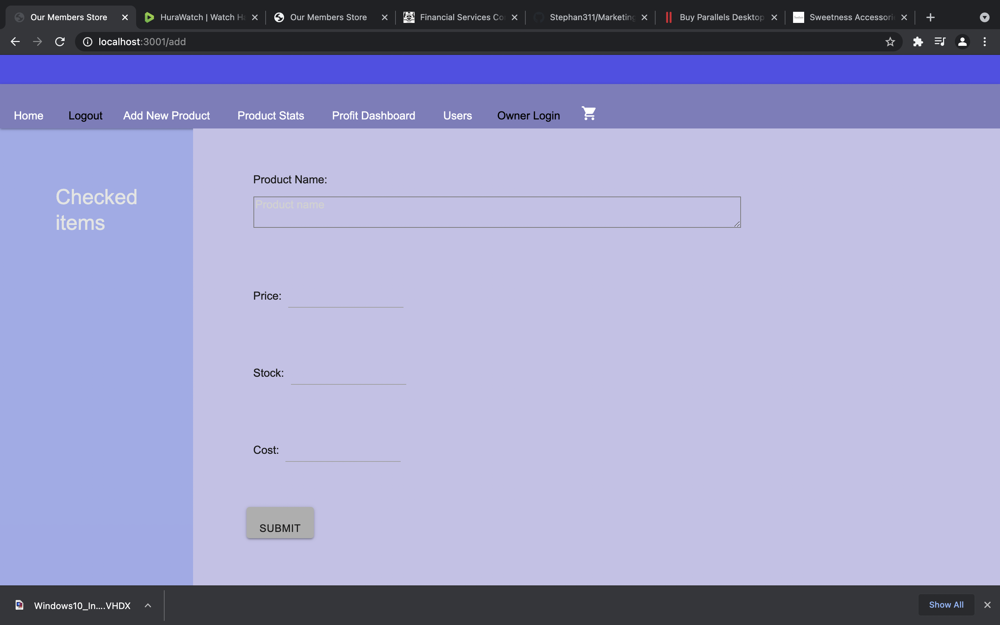
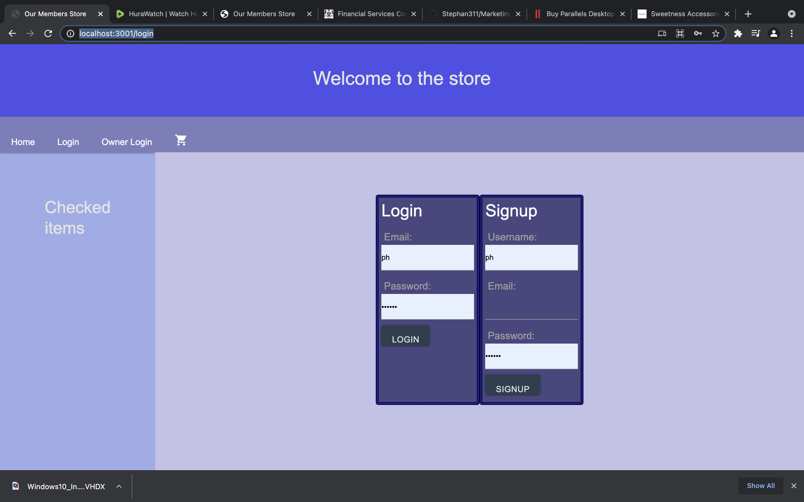
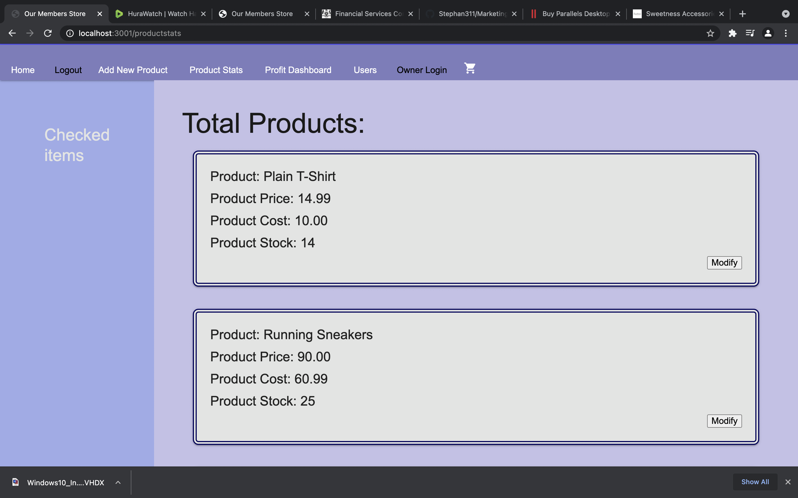
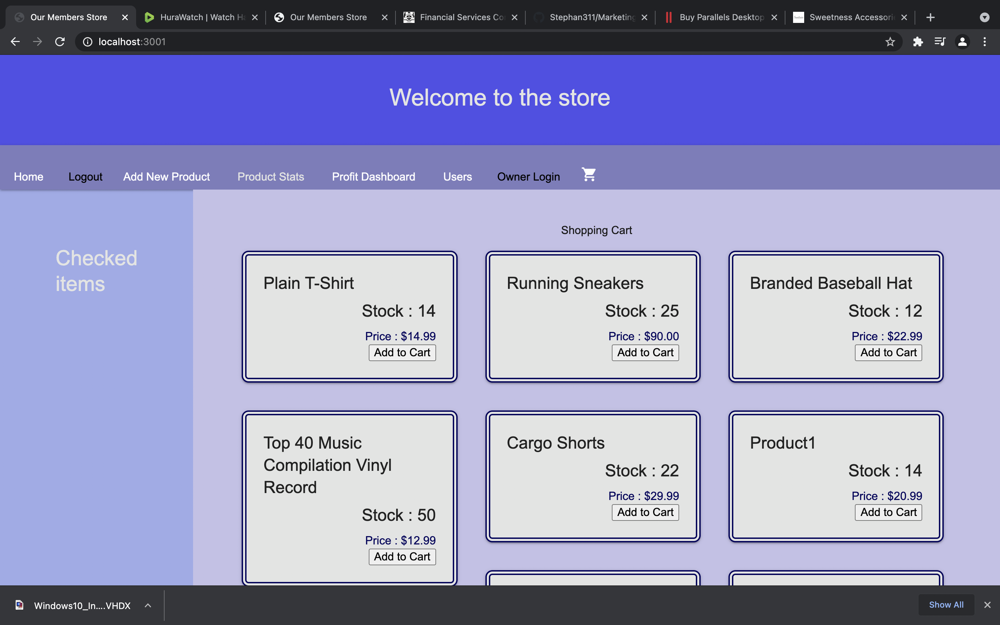
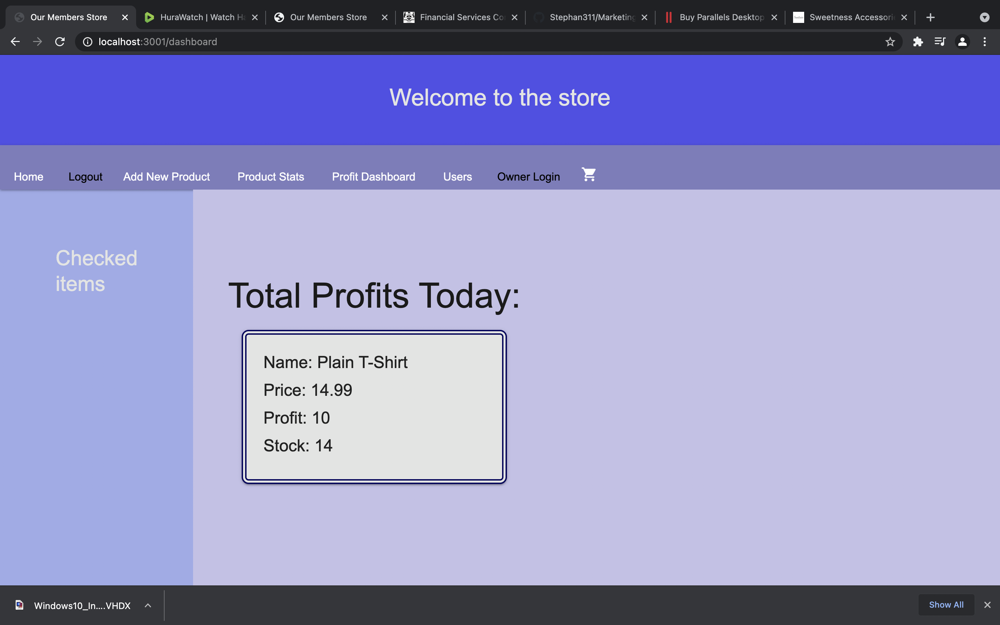
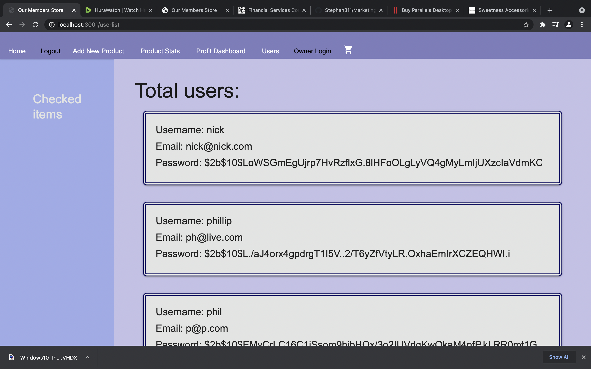
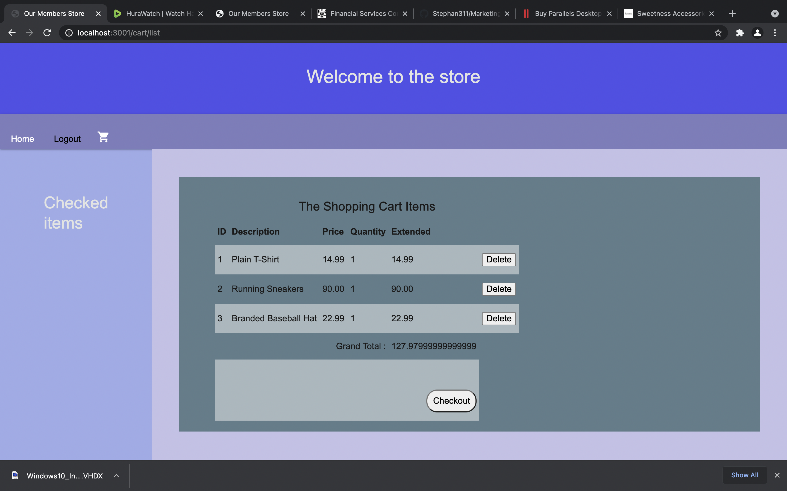
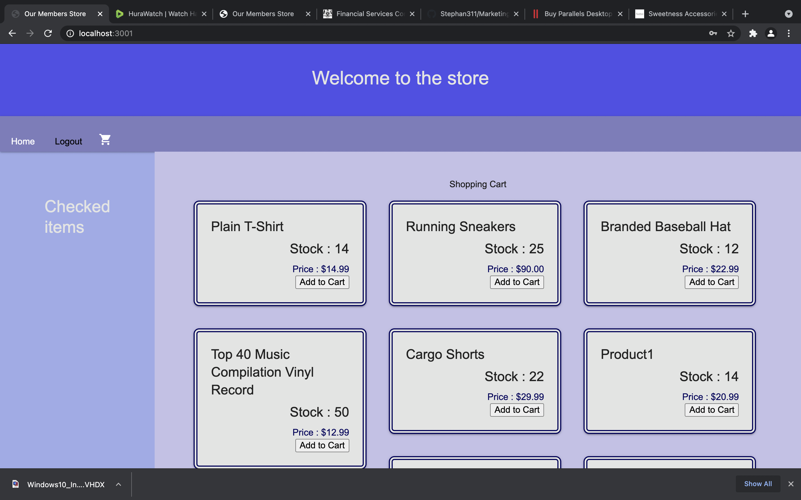

MARKETING REVENUE TRACKER  

 DESCRIPTION

 This app main purpose is to track revenue and profit form an online store environment,
when a customer buys a product this app does a live update to stock, revenue and profit 

customers need to sign up for an account to make purchases 
the Business owner needs to make an account for his Business
only a Business account can make changes to products, add products etc

customers have sperate login  and business owners have their own 

customers can add to cart after finsihed they can check 

Owner can login and check revenue and update stock and products

INSTALLATION 

this app is deploy though heroku, by click the link below you can 

After opening app on Heroku sign up and then log in.

to view our work via github also the source files for heroku

PICTURES OF THE APP
OWNER SETUP

this is example of the page for adding new products

login page example 

example page for owner gives more info about the products 

while login as owner this list, indicate what a customer would see

while owner is login you can see the sales of each item 

as the owner you can see who as signed upn for ur store

CUSTOMER SETUP

when customer is shopping this is an example of the cart with items

customer shoppinhg list example 

* Github URL : https://github.com/zahid267/Revenue-Tracker

* Heroku install URL : https://murmuring-headland-20273.herokuapp.com/